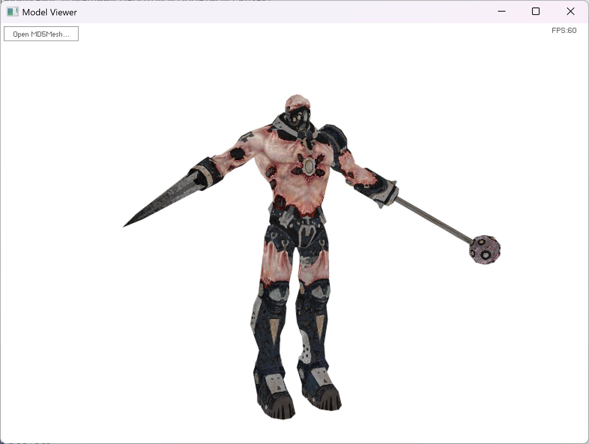
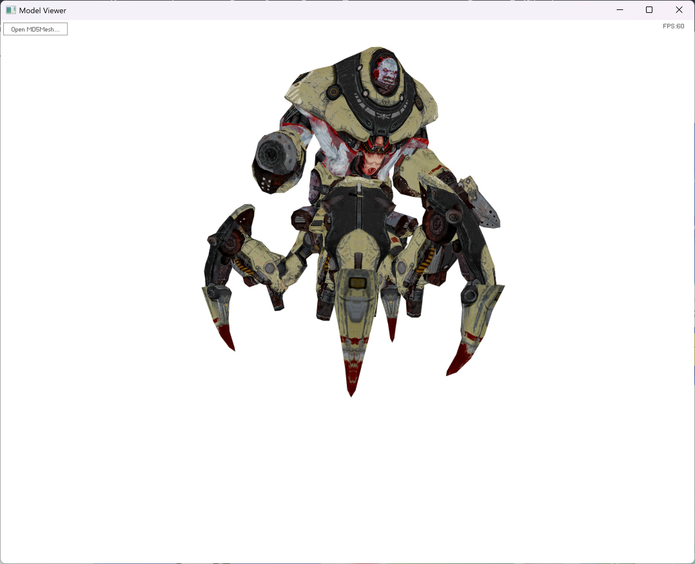

# Md5MeshModelViewer
## Description
This is my first project from 2010. I used FlashDevelop IDE, compiling and packing it in Adobe AIR project. The Air file can be installed and works on Win11. I didn't bother rebuilding it in 2025.
I was playing Doom 3, Quake 4 and making themes for my player iRiver e10 in Adobe Flash. It used ActionScripts 2
Later I discovered ActionScript 3 and Object Oriented Programming... and I started learning it
I liked it and I found out that as3 has tons of APIs for reading and opening files, parsing text, playing media files even working with 3d (rasteriser API worked on cpu, Stage3D API came out later)

Used articles (http://tfc.duke.free.fr/coding/md5-specs-en.html)

## Usage
Open md5mesh file. select textures for meshes
RMB to rotate, MWheel to zoom

## Screenshots

## Used 